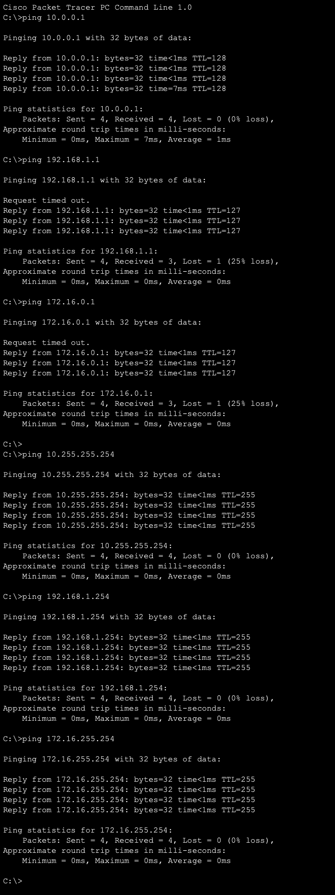

# IPv4 Addressing Lab — Class A, B, & C Networks

## Objective

Configure a router with three interfaces each connecting to a different address class (A, B, & C). Then assign static IP addresses to each end device of that network. Lastly, verify connectivity across all 3 networks.

## Topology


## Address Tables

### Router IP Address Table

| Device | Interface | IP Address      | Subnet Mask     | Network        | Class |
|--------|-----------|-----------------|-----------------|----------------|-------|
| R1     | Gi0/0     | 10.255.255.254  | 255.0.0.0       | 10.0.0.0/8     | A     |
| R1     | Gi0/1     | 192.168.1.254   | 255.255.255.0   | 192.168.1.0/24 | C     |
| R1     | Gi0/2     | 172.16.255.254  | 255.255.0.0     | 172.16.0.0/16  | B     |

### PC IP Address Table

| Device | Interface   | IP Address    | Subnet Mask     | Network        | Default Gateway | Class |
|--------|-------------|---------------|-----------------|----------------|-----------------|-------|
| PC1    | Gigabit NIC | 10.0.0.1      | 255.0.0.0       | 10.0.0.0/8     | 10.255.255.254  | A     |
| PC2    | Gigabit NIC | 10.0.0.2      | 255.0.0.0       | 10.0.0.0/8     | 10.255.255.254  | A     |
| PC3    | Gigabit NIC | 192.168.1.1   | 255.255.255.0   | 192.168.1.0/24 | 192.168.1.254   | C     |
| PC4    | Gigabit NIC | 192.168.1.2   | 255.255.255.0   | 192.168.1.0/24 | 192.168.1.254   | C     |
| PC5    | Gigabit NIC | 172.16.0.1    | 255.255.0.0     | 172.16.0.0/16  | 172.16.255.254  | B     |
| PC6    | Gigabit NIC | 172.16.0.2    | 255.255.0.0     | 172.16.0.0/16  | 172.16.255.254  | B     |

---

## Configuration

R1 was configured via CLI. The `do show ip interface brief` command 
was run after each interface to verify the configuration as it was applied.
```
enable
configure terminal
hostname R1

interface g0/0
  ip address 10.255.255.254 255.0.0.0
  description ## to SW1 ##
  no shutdown
  do show ip interface brief

int g0/1
  ip add 192.168.1.254 255.255.255.0
  desc ## to SW2 ##
  no shutdown
  do sh ip int br

int g0/2
  ip add 172.16.255.254 255.255.0.0
  desc ## to SW3 ##
  no shutdown
  do sh ip int br

end
write memory
```


## Verification

Pings from PC2 to devices across all three networks:



The first packet timeout is expected. This is a good representation of ARP (Address Resolution Protocol) resolution happening as R1 learns the destination MAC addresses. The remaining three packets were successful.

The ping on the same network (PC2 to PC1) had a return TTL=128, and pings across the networks had TTL=127. This confirms traffic passed through R1 since the default TTL is 128 and the ping across networks was 127. 128 - 127 = 1 hop.

## Key Takeaways

- Each network requires its own unique subnet mask matching its address class
- Each end device must have the correct default gateway in order for cross-network communication to work
- Router interfaces are shutdown by default and must use the `no shutdown` command to enable them. Switch interfaces are enabled by default
- TTL decrements by 1 (hop) each time traffic passes through a router. Can be used to confirm routing is happening
- The first ICMP packet timeout is normal on cross-network pings. It's caused by ARP resolution learning MAC addresses
- R1 acts as the default gateway for all three networks
- Inter-network routing works without a routing protocol because the three networks are directly connected to R1
- Good practice to abbreviate CLI commands to improve efficiency and reduce typos. Using descriptions on interfaces helps clarify what's what, especially on more complex networks
- Maintaining a clean and organized topology reduces mistakes and improves efficiency and scalability