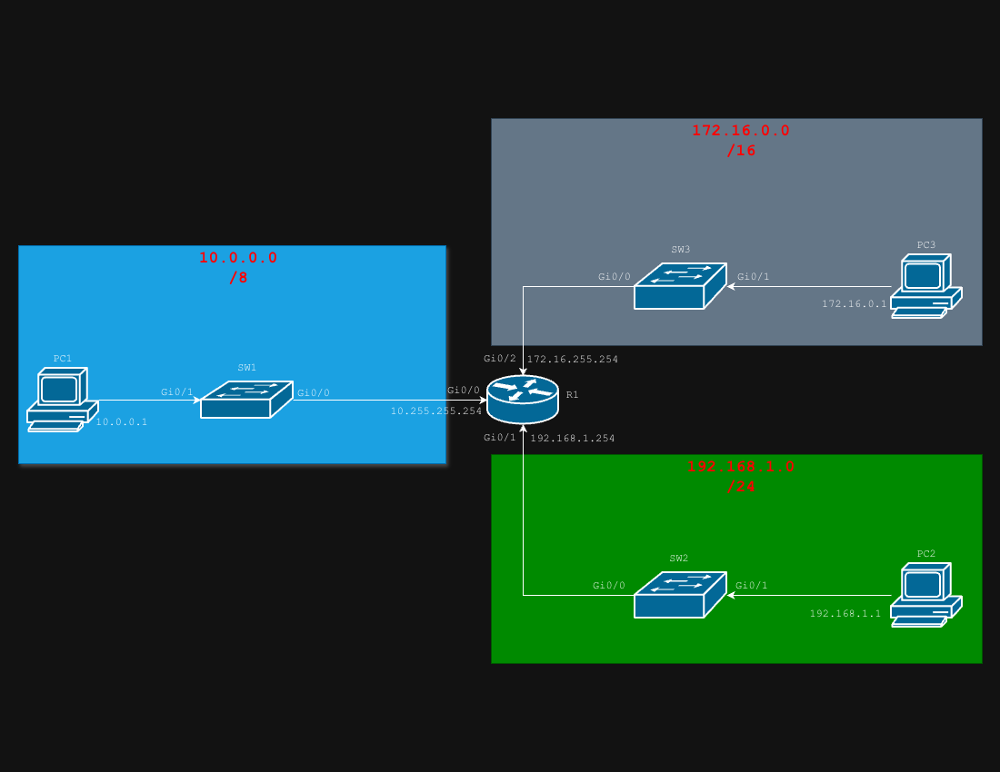

# IPv4 Addressing Lab — Class A, B, & C Networks

## Objective

Configure a router with three interfaces each connecting to a different address class (A, B, & C). Then assign static IP addresses to each end device of that network. Lastly, verify connectivity across all 3 networks.

## Topology

## Address Tables

### Router IP Address Table

| Device | Interface | IP Address      | Subnet Mask     | Network        |
|--------|-----------|-----------------|-----------------|----------------|
| R1     | Gi0/0     | 10.255.255.254  | 255.0.0.0       | 10.0.0.0/8     |
| R1     | Gi0/1     | 192.168.1.254   | 255.255.255.0   | 192.168.1.0/24 |
| R1     | Gi0/2     | 172.16.255.254  | 255.255.0.0     | 172.16.0.0/16  |

### PC IP Address Table

| Device | Interface | IP Address      | Subnet Mask     | Network        |
|--------|-----------|-----------------|-----------------|----------------|
| PC1    | NIC       | 10.0.0.1        | 255.0.0.0       | 10.0.0.0/8     |
| PC2    | NIC       | 192.168.1.1     | 255.255.255.0   | 192.168.1.0/24 |
| PC3    | NIC       | 172.16.0.1      | 255.255.0.0     | 172.16.0.0/16  |

---

## Classes of the Networks

| Device | Class | IP Address  | Subnet Mask   |
|--------|-------|-------------|---------------|
| PC1    | A     | 10.0.0.1    | 255.0.0.0     |
| PC2    | C     | 192.168.1.1 | 255.255.255.0 |
| PC3    | B     | 172.16.0.1  | 255.255.0.0   |
