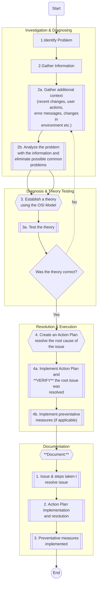

# Network Troubleshooting Methodology 

A sturctured approach to diagnosing, resolving, and documenting network issures using tools like the OSI Model and industry best practices.
By using a sturctured approach I can increase the level of success, improve efficency, and prevent other issues going over looked.

---

## 5-Step Troubleshooting Process

### When to Use Each OSI Approch

| Approach | Starting Layer | Best For |
|----------|---------------|----------|
| **Bottom-Up** | Layer 1 | Initial troubleshooting, no connection to anything |
| **Top-Down** | Layer 7 | Application specific issues, configuration issues |
| **Divide & Conquer** | Layer 3/4 | Unknown root cause, complex issues & systems |

---

## 🚧 Work in Progress

This guide is being actively developed as I progress through CCNA studies and labs. Coming soon:
- [ ] OSI Model Layer-by-Layer Reference Chart
- [ ] Command Reference Table
- [ ] Real Lab Troubleshooting Examples
- [ ] Decision Trees for Common Scenarios
